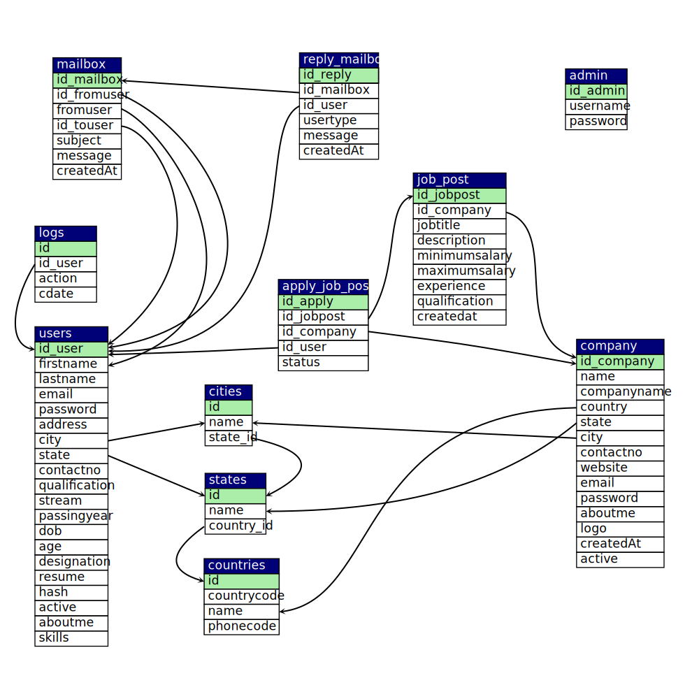

# Team

| Name         | ID            | Contribution            |
| ------------ | ------------- | ----------------------- |
| Ahmed Thahir | 2020A7PS0198U | Documentation, Diagrams |
|              |               |                         |
|              |               |                         |

# Introduction

## Tools

| Tool      | Full Form                 | Use                                                          |
| --------- | ------------------------- | ------------------------------------------------------------ |
| HTML      | HyperText Markup Language | Layout of web pages                                          |
| CSS       | Cascading Style Sheets    | Design of web pages                                          |
| Bootstrap |                           | CSS framework for developing responsive web pages            |
| Php       |                           | Backend<br />- Calling SQL<br />- Serving dynamic content to user |
| mySQL     |                           | Structured Relational Database Querying Language             |
| Xampp     |                           | - Database manipulation<br />- Locally hosting the website   |

# Limitations

1. Dynamic Sites are not as performant as static sites
2. Filter is not dynamic (it is hard-coded)
3. There are a few hyperlinks which don’t work properly
   - report button down as the site is not hosted on any server
4. The webpage is hosted locally at the moment. Needs to be run on the server.

# ER Diagram


# Schema Diagram



# Design

| Table                      | Details                                                      |
| -------------------------- | ------------------------------------------------------------ |
| `admin`                    | - admin username<br />- admin password<br />- Holds details about the active companies registered, candidates registered, total job posts and total applications.<br />- Permissions to remove any user or candidate<br />- Any company before being able to recruit and post jobs must be verified by the admin. |
| `apply_job_post`           | Id_apply: acts as primary key with auto increment on<br/>Id_job_post: acts as the id for the GET method of php for opening the specific webpage having job<br/>decription<br/>Id company/user : id of user or the company<br/>Status: status of the job post depending on the admin. A job post is published only after validation<br/>by the admin |
| `City`, `state`, `country` | - Large database of the cities, states and tables connected together by id of state and<br/>countries.<br />- Created separately since while creating forms the option to select country comes first, then the state and then the city.<br />- None of these are compulsory so the 3 tables are kept separately so that if a user only provides country or country-state it works as well. |
| `Company`                  | - Consists of all the details of the country. The logo is stored as image format in the uploads folder.<br />- Any company before being to operate must be able to be verified from the admin when their active column changes from 2 to 1. |
| `Users`                    | - Similar to the companies these include all the users looking for jobs.<br />- The resume is stored as pdf(size smaller than 5 mb) and is stored in the uploads folder.<br />- The passwords are stored after applying decoding so that even the admin or the superuser can’t access the password. |
| `Mailbox`,`Reply`          | - Inbuilt mailing technique b/w the users and the companies, the user can have converstion with the employee who have interest in their application.<br />- The design is similar to Gmail<br />- all the information is stored in the sql file i.e. the message, from, to and the date. |
# Implementation

## Connections

Let’s see how a connection with mysql is made.

In all the php pages which require access to database we include the db.php. db.php is a php which is used for establishing the sql connection. Rather than writing all of that separately in all the php files, we have created one db file and included this in all which we require.

For running any SQL query we just write the query similar to that in SQL and then run it using the
connection established.

```php
$result = $conn->query($sql);
```

## PHP File Roles

| PHP File                                | Role                                                         |
| --------------------------------------- | ------------------------------------------------------------ |
| `index.php`                             | The main php file that opens up at the start. Contains link to other pages like login and register and also the admin login. Shows 4(using sql limit) recently available job offers at the centre. |
| `jobs.php`                              | Contains the job offers 4 per page(again by using limit 4, for this code is written in `jobpagination.php`).<br />The filters applied are using the help of search.php which applies the filters of city and experience.<br />Currently the cities are navi-mumbai and Bengaluru but more can be added as required.<br />Clicking on any of these open the `view-job-post.php` |
| `view-job-post.php`                     | - also has an id at the end of url required to identified which job post page to open as all have the same format.<br />- This id is sent using the GET method of php. |
| `login.php`/`signup.php`/`register.php` | - These are the pages which open the login and signup pages.<br />- The details of username and password are checked using the `checklogin.php` and `checkcompanylogin.php`.<br />- All the login and register pages have the standard php code for validation of phone number, email id, pdf size etc.<br />- These can be seen at W3Schools itself. |
| Folders of `user`/`company`/`admin`     | - These contain the php pages to be loaded when the corresponding people are logged in.<br />- This is known by using the session global variable of php to know which of these is set.<br />- The php files within are pretty simple to those mentioned above with the exception that these are a little more specified for the particular kind of user. |

## Queries

### `addcompany.php`

Check if the email already exists so that every new company created has a new email.

```php
$sql = "SELECT email FROM company WHERE email='$email'";
```

Inserting new data retrieved from the form into the company table

```php
$sql = "INSERT INTO company(name, companyname, country, state, city,
contactno, website, email, password, aboutme, logo) VALUES ('$name',
'$companyname', '$country', '$state', '$city', '$contactno', '$website',
'$email', '$password', '$aboutme', '$file')";
```

### `adduser.php`

Similar to the above to check if the file already exists.

```mysql
$sql = "SELECT email FROM users WHERE email='$email'";
```

Inserting data into the user table

```php
$sql = "INSERT INTO users(firstname, lastname, email, password, address, city, state, contactno, qualification, stream, passingyear, dob, age, designation, resume, hash, aboutme, skills) VALUES ('$firstname', '$lastname', '$email', '$password', '$address', '$city', '$state', '$contactno', '$qualification', '$stream', '$passingyear', '$dob', '$age', '$designation', '$file', '$hash', '$aboutme', '$skills')";
```

### `apply.php`

This is not a file directly associated with the front end but called for processing of another file.

Retrieve all the data from the job_post table where id is taken from the GET function of php.

```php
$sql = "SELECT * FROM job_post WHERE id_jobpost='$_GET[id]'";
```

Check if the user has applied to the job post or not.

```php
$sql1 = "SELECT * FROM apply_job_post WHERE id_user='$_SESSION[id_user]' AND
id_jobpost='$row[id_jobpost]'";
```

Whenever a user applies for a job the details need to be added to the apply_job_post table.

```php
$sql = "INSERT INTO apply_job_post(id_jobpost, id_company, id_user) VALUES ('$_GET[id]', '$id_company', '$_SESSION[id_user]')";
```

### `checkcompanylogin.php`

Check if the login is correct or not.

```php
$sql = "SELECT id_company, companyname, email, active FROM company WHERE email='$email' AND password='$password'";
```

### `checklogin.php`

Check if the login is correct or not.

```php
$sql = "SELECT id_company, companyname, email, active FROM company WHERE email='$email' AND password='$password'";
```

### `city.php`

Select the cities from states. Similar is with the case in `state.php` in a layer by layer like fashion.

```php
$sql = "SELECT * FROM cities WHERE state_id='$_POST[id]'";
```

### `index.php`

Select 4 most recent job offers to display at the main screen.

```php
$sql = "SELECT * FROM job_post Order By createdat Limit 4";
```

Other sql commands are the simple select commands to get the count of various elements.

### `jobpagination.php`

Choosing 4 job posts at a time.

```php
$sql = "SELECT * FROM job_post LIMIT $start_from, $limit";
```

### `search.php`

Search specific company on the basis of inputted name.

```php
$sql = "SELECT * FROM job_post WHERE jobtitle LIKE '%$search%' LIMIT $start_from, $limit";
```

### `view-job-post.php`

Select details of the specific company on on the page on the basis of id sent by GET method of php.

```php
$sql = "SELECT * FROM job_post INNER JOIN company ON job_post.id_company=company.id_company WHERE id_jobpost='$_GET[id]'";
```

Similar queries in the user, company and admin php files for the specific user types.